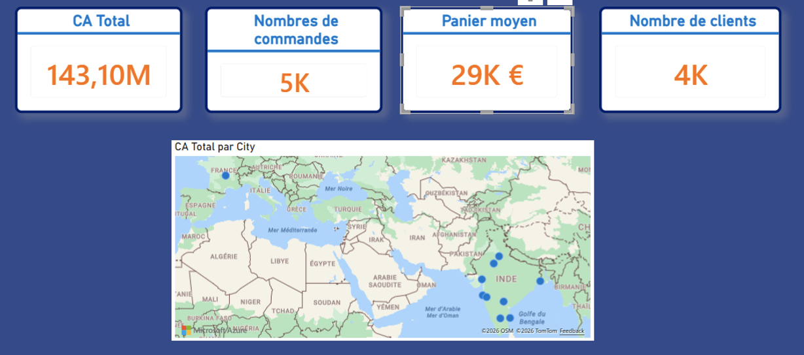

# 📊 NovaMarket – E-commerce Analysis
E-commerce performance and conversion analysis using Power BI

## 🎯 Project Overview

Analysis of NovaMarket's e-commerce performance to identify
conversion opportunities and understand customer behaviour.

## ❓ Business Problem

The objective of this project was to understand:

- Which categories generate the most revenue?
- Which devices convert best?
- Where do users abandon the purchasing funnel?
- Which actions could improve conversion?

## 🛠️ Tools

- Power BI
- Power Query
- DAX

## 📊 Dashboard

## 🔎 Key Insights

- Insight 1
- Insight 2
- Insight 3

## 💡 Recommendations

- Recommendation 1
- Recommendation 2
- Recommendation 3

## 📁 Project Files

### Power BI
Power BI dashboard available in the `powerbi` folder.

### Presentation
The complete project presentation is available in PDF and PowerPoint formats.

### Data
Sample dataset used for the analysis.
